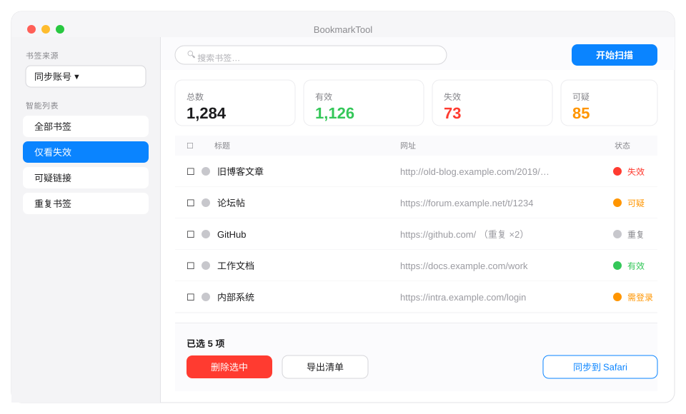

  

  <b>macOS 本地书签管家</b> —— 一键检测失效 / 重复书签，安全清理同步账号里"删不掉"的重复项，并同步到 Safari。
   
  🍎 仅支持 macOS（Apple Silicon / Intel）· Electron 桌面应用 · 数据完全本地

  <a href="#-功能特性">功能</a> ·
  <a href="#-核心优势">优势</a> ·
  <a href="#-和手动清理比如何">对比</a> ·
  <a href="#-安装">安装</a> ·
  <a href="#-使用流程">使用</a> ·
  <a href="#-隐私与安全">隐私</a> ·
  <a href="#-常见问题">FAQ</a>

---

> **English summary** — BookmarkTool is a local-first macOS desktop app (Electron) that scans your
> Chrome / Edge bookmarks for **dead links** and **duplicates**, lets you safely purge duplicates from a
> **sync account** (which normally "resurrect" because the cloud is authoritative — solved via the official
> `chrome.bookmarks` API through a bundled companion extension), and **syncs to Safari**. No bookmark data
> ever leaves your Mac.

## ✨ 功能特性

- 🔍 **失效链接检测**：逐个访问书签网址，区分「有效 / 失效 / 需登录 / 可疑」四种状态，不再靠肉眼翻。
- 🧹 **重复书签检测与批量删除**：找出指向同一网址的重复项，勾选后一键清理。
- ☁️ **安全清理同步账号重复项**：这是本工具最独特的能力——见下方「核心优势」。
- 🔁 **失效链接人工复核**：把疑似失效的书签逐条打开验证，标记为「有效」或「确认失效」，避免误删。
- 🧭 **智能列表筛选**：侧边栏一键只看「全部 / 仅看失效 / 可疑链接 / 重复书签」。
- 🍎 **一键同步到 Safari**：把整理后的书签导入 Safari，换浏览器更顺手。
- 🌗 **明暗自适应**：界面跟随 macOS 系统外观自动切换浅色 / 暗色。
- ⌨️ **清单手动删（免扩展）**：不想装扩展时，可导出带复选框的 HTML 清单，在书签管理器里逐条删。

## 🚀 核心优势

**1. 真正能删掉同步账号里的重复书签（这是关键痛点）**

同步账号的书签存在云端，云端是权威。你直接改本地书签文件，改动会被云端覆盖回来——**删掉的书签会"复活"**。
通用的书签清理工具都绕不过这一关。

BookmarkTool 的做法：用 Chrome 官方 `chrome.bookmarks` 接口删除。删除会生成"墓碑"并同步上云，
从此不再复活。而该接口**只有扩展能调用**，所以本工具随附一个常驻扩展，删除时由它代为执行。

**2. 本地优先 · 隐私可控**

你的书签数据只在本机处理，扩展仅监听 `127.0.0.1`（本机回环地址），**不做任何网络上报、不上传书签**。
可随时在 `chrome://extensions` 一键关闭或移除扩展。

**3. 不误删：检测 + 复核双重保险**

死链检测会把"访问异常但未必真死"的网址标为「可疑」而非直接判死；复核弹窗支持逐条打开验证、
手动标记为有效 / 失效，标记后行就地更新、不会突然从列表消失。

**4. macOS 原生体验**

侧边栏 + 系统蓝强调色 + 系统字体 + 150ms 微动效，跟随系统明暗，和访达 / 邮件一个家族。

## 📊 和手动清理比如何

| 能力 | 手动在书签管理器删 | 通用书签清理网站 | **BookmarkTool** |
|---|---|---|---|
| 检测失效链接 | 一个个点开，累 | 多半要上传书签到云端 | ✅ 本地检测，数据不出本机 |
| 删除同步账号重复项 | ❌ 删了会复活 | ❌ 同样复活 | ✅ 通过官方接口成墓碑删除 |
| 重复书签识别 | 肉眼找，易漏 | 部分支持 | ✅ 自动识别 + 批量勾选 |
| 误删风险 | 高 | 中 | ✅ 可疑状态 + 人工复核 |
| 同步到 Safari | 手动导出导入 | 不相关 | ✅ 一键 |
| 隐私 | — | ⚠️ 书签上云 | ✅ 完全本地 |

## 🖥 界面预览

  

> 上图为 macOS 原生风格界面示意：左侧栏选来源 + 智能列表筛选，顶部指标卡汇总检测结果，
> 主表格按状态色点（红=失效 / 橙=可疑·需登录 / 绿=有效 / 灰=重复）一目了然。

## 📥 安装

1. 到 [Releases](https://github.com/cjpaysan/chrome-bookmark-tool/releases) 下载最新的
   `BookmarkTool-x.x.x-macos.dmg`，拖入「应用程序」。
2. 首次打开若被 Gatekeeper 拦截（"无法验证开发者"）：
   - 右键 → **打开**（仅拦一次）；或
   - 终端执行 `xattr -cr /Applications/BookmarkTool.app` 后再正常打开。
3. 启动后，顶部工具栏显示扩展连接状态、版本号与搜索框。

> 本软件未使用付费开发者签名（个人分发），因此首次打开需上述一步绕过。这不是恶意软件，
> 源代码完全公开可查。

## 🧭 使用流程

1. 左侧栏选择书签来源（同步账号会标注"同步账号"）。
2. 点工具栏「开始扫描」执行检测（读 Chrome / Edge 书签 → 访问验证 → 查重）。
3. 扫描完成后：
   - 顶部指标卡显示总数 / 有效 / 失效 / 需登录 / 疑似失效。
   - 「重复 / 冗余书签」里勾选要处理的，点「删除选中」。
   - 若来源是同步账号且首次删除：会先弹窗说明"为什么必须装扩展"，按指引在
     `chrome://extensions` 加载随附扩展（装一次、永久生效），之后删除全自动。
4. 想整理失效书签：点「复核失效」逐条验证，或直接在表格状态列点状态徽标切换
   （可疑 ↔ 失效、有效 → 失效；Shift+点击清除手动标记）。
5. 整理完毕可点「同步到 Safari」导出。

## 🔒 隐私与安全

- 随附扩展**仅与本机 `localhost` 通信**，不联网、不上报、不上传你的书签。
- 删除只调用本地 Chrome 官方接口，删完扩展**不自卸载、不退出登录、不重启浏览器**。
- 可随时在 `chrome://extensions` 关闭或移除扩展，不留后门。

## ❓ 常见问题

**Q：为什么要装一个扩展？不能直接改书签文件吗？**
A：同步账号的书签以云端为权威，改本地文件会被覆盖回滚（删掉的书签复活）。只有扩展能调用
官方删除接口生成"墓碑"同步上云。稳定版 Chrome 137+ 已禁用命令行静默加载扩展，所以改为你手动
"加载已解压的扩展程序"一次，装好即永久生效。

**Q：我的书签会被上传吗？**
A：不会。所有检测、查重、删除都在本机完成，扩展只听 `127.0.0.1`。

**Q：只支持 Chrome 吗？**
A：读取 Chrome / Edge 等 Chromium 系浏览器的书签；删除走官方接口；整理结果可一键同步到 Safari。

**Q：没有 Apple 开发者签名，安全吗？**
A：源码完全公开。未签名只是因为个人分发未购买付费证书，首次打开按上方"安装"绕过即可。

**Q：支持 Windows / Linux 吗？**
A：当前仅 macOS。代码基于 Electron，理论上可移植，但暂未做跨平台适配。

## 🗂 项目结构

| 目录 / 文件 | 说明 |
|---|---|
| `src/server.js` | 本地 Web 服务（GUI + 扫描 + 文件夹选择 + 扩展桥接） |
| `public/` | 前端页面（Electron 内渲染，macOS 原生风） |
| `electron/` | Electron 主进程 |
| `ext/` | 常驻扩展源码（manifest.json + background.js），打包为 `ext/bookmark-cleaner-extension.zip` |
| `scripts/` | 版本号管理（`bump-version.mjs` / `sync-version.mjs` / `rename-dmg.mjs`） |

## 🔢 版本号规则

采用 `主.次.修.构建` 四段展示版（如 `1.2.0.3`）：

- 极小改动（几行 hotfix）→ 第四位 +1
- 小改动（一个功能）→ 第三段 +1
- 中等（新功能模块）→ 第二段 +1
- 大改（架构重写）→ 第一段 +1

DMG 文件名与界面版本号同步变化，方便区分每次构建。

## 🤝 反馈与贡献

欢迎在 [Issues](https://github.com/cjpaysan/chrome-bookmark-tool/issues) 提建议或报 bug。
如果它帮你清理了成百上千条垃圾书签，点个 ⭐ Star 就是最大的支持。
